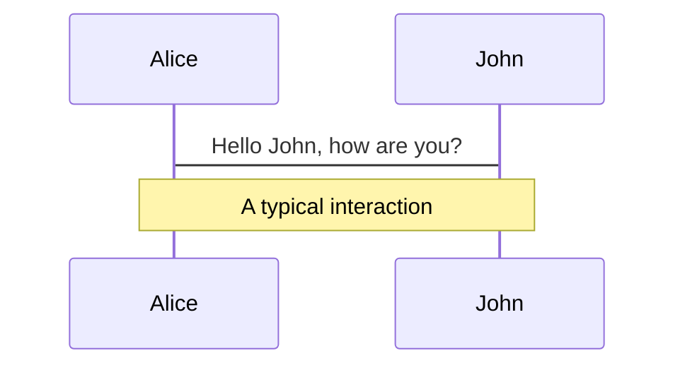
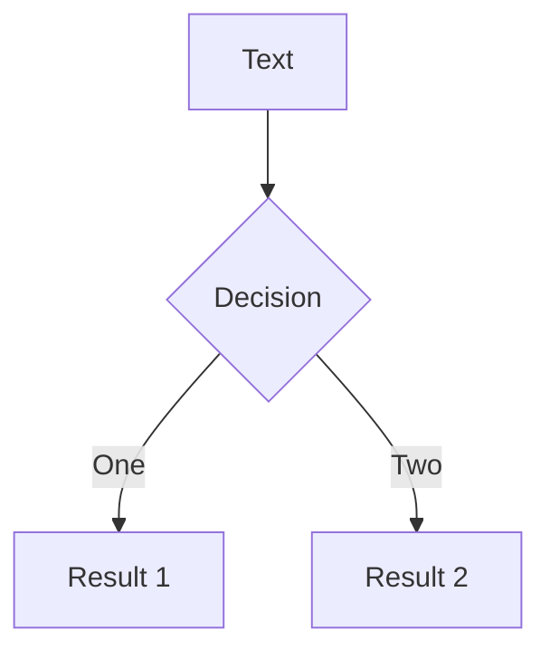
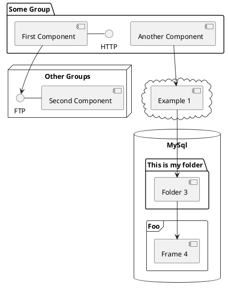

# Git の構成管理

<div class="mt-8 opacity-70 text-2xl">河崎 一希</div>

---
layout: cover
---
# 構成管理とは

<p class="text-center">いつ・誰が・どんなタイミングでリポジトリを更新するのか決めたルール</p>

<div class="grid grid-cols-2 gap-10 pt-4 -mb-6">
  <div class="flex flex-col">
    <p class="mb-8">Github Flow</p>

  </div>

  <div class="flex flex-col">
    <p class="mb-8">Gitlab Flow</p>
```mermaid {scale: 0.8, gitGraph: {showCommitLabel: false, mainBranchOrder: 2}}
  gitGraph
      commit
      branch feature-x order: 1
      commit
      commit
      checkout main
      merge feature-x
      checkout main
      branch pre-production order: 2
      commit
      branch production order: 3
      commit
```
  </div>
</div>

<!--
その前にまず皆さん、、
-->

---
layout: cover
class: text-center
---
<h1>ブランチとは<br>○○ の ○○ である</h1>

分かるひとー 🙋🙋🙋‍♀️

<!--
これ、シンプルに説明できますか。
-->

---
layout: cover
---

<h1>Git そのものが<br>わからなすぎ問題</h1>

<!--
多くの人がGitを正しく理解していない
Gitの引き起こした結果だけを見て経験則で対処している

その状態では、せいぜいGitを使える程度
Gitを応用した構成管理を理解できないし、考えるなど到底不可能

なので、さっきのタイトルは嘘
-->
---
layout: cover
class: text-center
---
# Git の構成管理
<div v-click class="text-4xl">
の前に知っておきたい基礎知識<br />
〜ブランチ編〜
</div>

<div class="mt-8" v-click>
  <material-symbols-arrow-downward class="text-3xl"/>
  <p class="text-3xl">ブランチを理解して使いこなせるようになろう</p>
</div>

<!--
ローカルリポジトリとリモートリポジトリの話やコマンドの解説もしたいところだが、
量が多すぎるので今回はブランチをメインに解説

構成管理ということで、GitHub Flow とか GitLab Flow とか有名どころの管理方法を紹介してもよかったのですが、
Git を経験則だけで使うのはしんどいし
正しい知識がないと構成管理を考えるのは無理

また、自分が考えることができたとしても、メンバーが理解してくれなければ意味がない

なので今日は
-->

---

# なぜブランチなのか


---

Use code snippets and get the highlighting directly![^1]

```ts {all|2|1-6|9|all}
interface User {
  id: number
  firstName: string
  lastName: string
  role: string
}

function updateUser(id: number, update: User) {
  const user = getUser(id)
  const newUser = { ...user, ...update }
  saveUser(id, newUser)
}
```

<arrow v-click="3" x1="400" y1="420" x2="230" y2="330" color="#564" width="3" arrowSize="1" />

[^1]: [Learn More](https://sli.dev/guide/syntax.html#line-highlighting)

<style>
.footnotes-sep {
  @apply mt-20 opacity-10;
}
.footnotes {
  @apply text-sm opacity-75;
}
.footnote-backref {
  display: none;
}
</style>

---

# Components

<div grid="~ cols-2 gap-4">
<div>

You can use Vue components directly inside your slides.

We have provided a few built-in components like `<Tweet/>` and `<Youtube/>` that you can use directly. And adding your custom components is also super easy.

```html
<Counter :count="10" />
```

<!-- ./components/Counter.vue -->
<Counter :count="10" m="t-4" />

Check out [the guides](https://sli.dev/builtin/components.html) for more.

</div>
<div>

```html
<Tweet id="1390115482657726468" />
```

<Tweet id="1390115482657726468" scale="0.65" />

</div>
</div>


---
class: px-20
---

# Themes

Slidev comes with powerful theming support. Themes can provide styles, layouts, components, or even configurations for tools. Switching between themes by just **one edit** in your frontmatter:

<div grid="~ cols-2 gap-2" m="-t-2">

```yaml
---
theme: default
---
```

```yaml
---
theme: seriph
---
```


</div>

Read more about [How to use a theme](https://sli.dev/themes/use.html) and
check out the [Awesome Themes Gallery](https://sli.dev/themes/gallery.html).

---
preload: false
---

# Animations

Animations are powered by [@vueuse/motion](https://motion.vueuse.org/).

```html
<div
  v-motion
  :initial="{ x: -80 }"
  :enter="{ x: 0 }">
  Slidev
</div>
```

<div class="w-60 relative mt-6">
  <div class="relative w-40 h-40">
    
    
    
  </div>

  <div
    class="text-5xl absolute top-14 left-40 text-[#2B90B6] -z-1"
    v-motion
    :initial="{ x: -80, opacity: 0}"
    :enter="{ x: 0, opacity: 1, transition: { delay: 2000, duration: 1000 } }">
    Slidev
  </div>
</div>

<!-- vue script setup scripts can be directly used in markdown, and will only affects current page -->
<script setup lang="ts">
const final = {
  x: 0,
  y: 0,
  rotate: 0,
  scale: 1,
  transition: {
    type: 'spring',
    damping: 10,
    stiffness: 20,
    mass: 2
  }
}
</script>

<div
  v-motion
  :initial="{ x:35, y: 40, opacity: 0}"
  :enter="{ y: 0, opacity: 1, transition: { delay: 3500 } }">

[Learn More](https://sli.dev/guide/animations.html#motion)

</div>

---

# LaTeX

LaTeX is supported out-of-box powered by [KaTeX](https://katex.org/).

<br>

Inline $\sqrt{3x-1}+(1+x)^2$

Block
$$
\begin{array}{c}

\nabla \times \vec{\mathbf{B}} -\, \frac1c\, \frac{\partial\vec{\mathbf{E}}}{\partial t} &
= \frac{4\pi}{c}\vec{\mathbf{j}}    \nabla \cdot \vec{\mathbf{E}} & = 4 \pi \rho \\

\nabla \times \vec{\mathbf{E}}\, +\, \frac1c\, \frac{\partial\vec{\mathbf{B}}}{\partial t} & = \vec{\mathbf{0}} \\

\nabla \cdot \vec{\mathbf{B}} & = 0

\end{array}
$$

<br>

[Learn more](https://sli.dev/guide/syntax#latex)

---

# Diagrams

You can create diagrams / graphs from textual descriptions, directly in your Markdown.

<div class="grid grid-cols-3 gap-10 pt-4 -mb-6">







</div>

[Learn More](https://sli.dev/guide/syntax.html#diagrams)

---
src: ./pages/multiple-entries.md
hide: false
---

---
layout: center
class: text-center
---

# Learn More

[Documentations](https://sli.dev) · [GitHub](https://github.com/slidevjs/slidev) · [Showcases](https://sli.dev/showcases.html)
