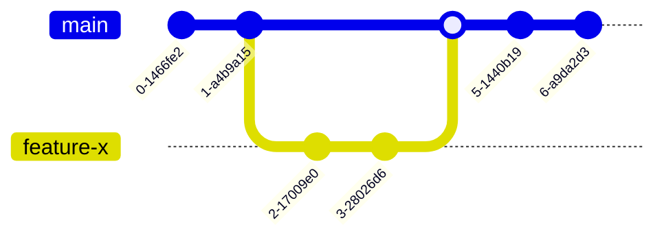

# Git の構成管理

<div class="mt-8 opacity-70 text-2xl">河崎 一希</div>

---
layout: cover
---
# 構成管理とは

<p class="text-center">適切なタイミングで適切な資産を提供するために <br /> いつ・誰が・どんなタイミングでリポジトリを更新するのか決めたルール</p>

<div class="grid grid-cols-2 gap-10 pt-4 -mb-6">
  <div class="flex flex-col">
    <p class="mb-8">Github Flow</p>

  </div>

  <div class="flex flex-col">
    <p class="mb-8">Gitlab Flow</p>
```mermaid {scale: 0.8, gitGraph: {showCommitLabel: false, mainBranchOrder: 2}}
  gitGraph
      commit
      branch feature-x order: 1
      commit
      commit
      checkout main
      merge feature-x
      checkout main
      branch pre-production order: 2
      commit
      branch production order: 3
      commit
```
  </div>
</div>

<!--
その前にまず皆さん、、
-->

---
layout: cover
class: text-center
---
<h1>ブランチとは<br>○○ の ○○ である</h1>

シンプルに説明できますか。

<!--

-->

---
layout: cover
---

<h1>Git そのものが<br>わからなすぎ問題</h1>

<!--
多くの人がGitを正しく理解していない
Gitの引き起こした結果だけを見て経験則で対処している

その状態では、せいぜいGitを使える程度
Gitを応用した構成管理を理解できないし、考えるなど到底不可能

Git を正しく理解するのが先
なので、さっきのタイトルは嘘
-->
---
layout: cover
class: text-center
---
# Git の構成管理
<div v-click class="text-4xl">
の前に知っておきたい基礎知識<br />
〜ブランチ編〜
</div>

<FactArrow>ブランチを理解して使いこなせるようになる</FactArrow>

<!--
ローカルリポジトリとリモートリポジトリの話やコマンドの解説もしたいところだが、
量が多すぎるので今回はブランチをメインに解説

目標はブランチとはなんなのか理解してもらうこと
これだけでは構成管理まで考えるのは難しいかもしれないが
様々な既存の構成管理の意味は理解しやすくなるはず

でははじめに先ほどの答えを見てみる
-->

---
layout: cover
class: text-center
---
<h1>ブランチとは<br>○○ の ○○ である</h1>

<!--
これの答えは
-->
---
layout: cover
class: text-center
---
<h1>ブランチとは<br><strong>コミット</strong>の<strong>ポインタ</strong>である</h1>

<!-- 
その他、参照・エイリアスなど

それぞれの意味を確認してみる
-->
---

# ブランチとはコミットのポインタである

## ポインタ

**何かの位置を指し示すための仕組みや道具のこと** <At no=1 />  
Git の用語ではない。プログラミングではメモリアドレス参照の意味。  
ブランチはあるコミットを指し示している ＝ コミットのポインタ <At no=2 />

<FactArrow>
  ブランチにはコミットを指し示す以外の機能は無い
  <template #body>
    分岐させる機能もない
  </template>
</FactArrow>

<FactArrow :underline="false">では誰がどうやって分岐させるのか</FactArrow>

<!-- 
ポインタはC言語とかでやるやつ
プログラミングでは実体の場所が入っている変数のこと
ブランチも同じように、たくさんあるコミットのうち１つを指し示している

ここで覚えておいていただきたいのは、ブランチはコミットを指し示すだけで機能としてはこれ以上特にない。（指し示すコミットが変わるなど、挙動はあるが）

ある程度 Git を触った経験があるが理解していない人は分岐させるものだと考えていることがあり、
経験の少ない人はプロジェクトを丸ごと別のフォルダにコピーしたかのように考えていることがある。

後で詳細を見ていくが、ただのテキストファイルに参照先のコミットIDが書かれているだけ。

GIｔ 未経験で SVN の経験がある人は特にブランチを物理的な分岐と考えていることがあり、Git の概念に馴染みづらい。
それは Git のブランチが単純すぎるから。

ではブランチがただのポインタであるなら、どうやって分岐させるのか。
それはコミットが勝手にやってくれる。
-->

---
layout: cover
class: text-center
---

# コミット

分岐はコミットによって作られる  
正確には、その仕組み上 分岐ができる

<FactArrow>
  コミットを理解すれば多くのコマンドが扱える
  <template #body>
  <code>git commit</code>, 
  <code>git cherry-pick</code>, 
  <code>git rebase</code>, 
  <code>git push -f</code>, 
  <code>git pull --rebase</code>, etc.
  </template>
</FactArrow>

<!-- 
分岐を作るのはコミット
明示的に分岐させる作業があるわけではなく、その仕組み上、分岐すべきタイミングで勝手にできる

コミットを理解すれば、push や pull でエラーが発生する理由と対応も分かるし、リベースを使ったコミットの整理ができるようになる
特にリベースは構成管理において扱いやすい履歴を残すために重要な機能

リベース禁止というルールをネットで見かけることがあるが、いろいろ諦めすぎでは。。
禁止すべきは push -f であって rebase は好きなだけやればいい（もちろんテストしてね）

では改めて、コミットとはなにか。
-->

---

# コミットとはなにか　

一般的には、〔～に〕責任を持つ、〔～と〕約束する、〔～を〕誓う、〔～を〕明言［表明］する <At no=3 />  
Git では、ある時点のプロジェクトの**メタデータとスナップショットを記録する操作**

## メタデータ

データそのものではなく、そのデータを表す属性や関連する情報を記述したデータのこと <At no=4 />  
コミットにおけるメタデータにはコミットメッセージや作業者の名前などが記録される
## スナップショット

ある時点のファイル、ディレクトリ、データベースファイルなどの状態を抜き出したもの <At no=5 />  
Git は**効率的なスナップショット**をコミット毎に作成している

<!--
コミットはビジネス用語として有名
Git の場合は「こういう作業をしました」と名言・表明するところから来ているのだと思う

メタデータはデータについてのデータのこと
詳しくは後述

スナップショットはある時点のプロジェクトを丸ごとバックアップしたもの
Gitはスナップショットをコミット毎に作成している
効率的、という部分は後に回して、、

ここで覚えておいていただきたいのが、コミットはスナップショットであるから、差分ではないということ
-->

---

# コミットはメタデータとスナップショット

<FactArrow :arrow="false" :click="false">
  コミットはスナップショットであり差分ではない <At no=6 />
  <template #body>
    ある時点のプロジェクトをまるごと保存している <br />
    <code>git diff</code> などで表示される差分は常に動的に計算されている
  </template>
</FactArrow>

<div class="mt-12 text-center">
  <blockquote class="inline-block">
    <p class="text-left">
      混乱の根本的な原因は、コミットは 差分 であり順番を入れ替えることができるという解釈にあります。<br>
      しかし、<strong>コミットはスナップショットであって、差分ではありません!</strong>
    </p>
    <small>
      <a href="https://github.blog/jp/2021-01-06-commits-are-snapshots-not-diffs/">GitHubブログより引用</a>
    </small>
  </blockquote>
</div>

<FactArrow :click="false">
  <template #body>
    差分であるという認識では、<br />
    異なるファイルを変更した２つコミットは入れ替えることが可能なように思えてしまう
  </template>
</FactArrow>

<!--
差分ではないということは、プロジェクトを指定したコミット時点の状態にしたいときそれ以前の過去のコミットを遡る必要がないということ。
差分の場合は指定したコミットから１つずつ差分を適用していく必要があり、期間に比例するように時間がかかる

一方スナップショットは指定したコミット１つからその時点の状態にすることができる

実際には rebase でコミットを入れ替えることが可能だが、そのコミット以降の全てのコミットに影響する

なぜそのようになるのかという理由も含めて、
ここからは実際にコミットがどのように作れるのかをみていく
-->

---
layout: cover
class: text-center
---

# 逆にどうやって作りますか？

もしかすると数十年続くかもしれないプロジェクト内で、  
コミットに一意なIDを振り続ける仕組み  
<span v-click class="mt-4 inline-block">
  に加えて  
  SVNなどのバージョン管理システムよりも高速で低容量で、  
  コミット間の差分が素早く取れるし、プロジェクトをある時点に戻すのも素早く  
  そして開発者ごとに独立したソースで開発がしたい
</span>

---

# ここまでのまとめ

## 構成管理を知りたい・考えたい

ブランチをどう扱うかが重要だが、正確に理解している人は少ない  
構成管理を知り考えるためにまずはブランチを理解する

## ブランチとはなにか

コミットへのポインタ

## コミットとはなにか

スナップショットとメタデータを記録する操作

<!-- 

目的は構成管理の理解だが、ブランチについて理解してないと構成管理の意味が分からない
のでブランチを理解する

そのブランチはコミットを指し示すだけだった
指し示す先のコミットとはなんなのか

これからする話はコミットがGitというソフトウェアにおいてどう扱われているか。
どう保存され、どう参照されているのかを見てみる。

これは利用する側の視点というよりは開発者としての視点で見たほうが分かりやすい。
例えば別のシステムで取引情報はどうに保存されているかと言えば、
DB の transaction テーブルに取引日時カラムと取引金額カラムと、、、である。
同様にコミットはどこに保存されているのか

 -->

---

# コミットとは

<div class="flex justify-around">
  

  <div class="flex items-center">

  </div>
</div>

<!-- 
改めて、普段目にするコミットはこんな感じ
GUIクライアントの1行がコミット
あるいは構成管理などでは図で示される場合は1つの〇がコミット

 -->

---
layout: two-col
---

# コミットとは

::left::

```shell {1|all}
> git log

commit cc526893809748944a2591f5a2901f2598945fdf (HEAD -> master)
Author: kawasaka.SOLDIV <kawasaka@creo.co.jp>
Date:   Tue Oct 18 21:04:35 2022 +0900

    second commit

commit aee937a7aadc4e972bc1f70111282926de4f4da3
Author: kawasaka.SOLDIV <kawasaka@creo.co.jp>
Date:   Tue Oct 18 20:53:35 2022 +0900

    first commit
```

::right::

Git は CUI ツールなのでコマンドラインで実行する  
GUI のクライアントソフトも裏でコマンドを実行している

コミットの一覧を表示するには `git log` を実行

<!-- 
git log の実行結果が左

詳細を見ていく
 -->
---
layout: two-col-2
---

# コミットとは

<div class="grid grid-cols-[2fr,1fr]">

  <div>

```shell {all|3-7|3|4|5|7|all}
> git log

commit cc526893809748944a2591f5a2901f2598945fdf (HEAD -> master)
Author: kawasaka.SOLDIV <kawasaka@creo.co.jp>
Date:   Tue Oct 18 21:04:35 2022 +0900

    second commit

commit aee937a7aadc4e972bc1f70111282926de4f4da3
Author: kawasaka.SOLDIV <kawasaka@creo.co.jp>
Date:   Tue Oct 18 20:53:35 2022 +0900

    first commit
```

  </div>
  <div>

1. コミットID
1. ブランチ
1. 作業者の情報
1. コミット日時
1. コミットメッセージ

  </div>
</div>

<!-- 
ハイライト部分が１つのコミット

(3行目 ~ 7行目の紹介)

これらはコミットを閲覧用に整形したもの
コマンドのオプションによってGUIの樹形図のように表示したりもできる

では実際のコミットのデータはどこにあるのか
 -->
---

# コミットの保存場所

## .git

コミットに限らずプロジェクトの Git のデータはすべて .git ディレクトリに保存される

```sh {all|7}
/what-is-git-workflow
> ls -al

合計 3333
drwxr-xr-x 1 SOLDIV+kawasaka 2147484161 0 10月 18 20:59 ./
drwxr-xr-x 1 SOLDIV+kawasaka 2147484161 0 12月  6 17:49 ../
drwxr-xr-x 1 SOLDIV+kawasaka 2147484161 0 12月  6 17:21 .git/
-rw-r--r-- 1 SOLDIV+kawasaka 2147484161 6 10月 18 20:35 benkyokai.txt
drwxr-xr-x 1 SOLDIV+kawasaka 2147484161 0 10月 18 21:00 sub-dir/
```

<!-- 
git 管理されているプロジェクトのルートディレクトリ直下を一覧表示
.git ディレクトリにすべてのコミットと git の設定ファイルなどが含まれている

.git の中身を見てみる
 -->

---

# コミットの保存場所

## .git/objects

コミットをはじめ、プロジェクト内の管理対象のファイルが保存されるディレクトリ


```sh {all|13}
/what-is-git-workflow
> ls -al .git

合計 13
-rw-r--r-- 1 SOLDIV+kawasaka 2147484161  14 10月 18 21:04 COMMIT_EDITMSG
-rw-r--r-- 1 SOLDIV+kawasaka 2147484161 112 10月 18 20:35 config
-rw-r--r-- 1 SOLDIV+kawasaka 2147484161  73 10月 18 20:35 description
-rw-r--r-- 1 SOLDIV+kawasaka 2147484161  23 10月 18 20:35 HEAD
drwxr-xr-x 1 SOLDIV+kawasaka 2147484161   0 10月 18 20:35 hooks/
-rw-r--r-- 1 SOLDIV+kawasaka 2147484161 265 10月 18 21:04 index
drwxr-xr-x 1 SOLDIV+kawasaka 2147484161   0 10月 18 20:35 info/
drwxr-xr-x 1 SOLDIV+kawasaka 2147484161   0 10月 18 20:53 logs/
drwxr-xr-x 1 SOLDIV+kawasaka 2147484161   0 10月 18 21:04 objects/
drwxr-xr-x 1 SOLDIV+kawasaka 2147484161   0 10月 18 20:35 refs/
```

<!-- 

実際にはコミットだけが保存される専用の場所というのは無い
.git/objects にはコミットと管理対象のファイルが全て入っている

コミットはスナップショットとメタデータを記録するが、それらが全て objects ディレクトリに入っている

objects には何が入っているか
 -->

---
layout: two-col-2
---

# コミットの保存場所

::left::
## .git/objects の中身

<div class="h-2"></div>

```sh {2-11}
/what-is-git-workflow
> ls -al .git/objects/

合計 0
drwxr-xr-x 1 SOLDIV+kawasaka 2147484161 0 10月 18 21:04 20/
drwxr-xr-x 1 SOLDIV+kawasaka 2147484161 0 10月 18 21:04 a4/
drwxr-xr-x 1 SOLDIV+kawasaka 2147484161 0 10月 18 20:53 a6/
drwxr-xr-x 1 SOLDIV+kawasaka 2147484161 0 10月 18 20:53 ae/
drwxr-xr-x 1 SOLDIV+kawasaka 2147484161 0 10月 18 21:04 cc/
drwxr-xr-x 1 SOLDIV+kawasaka 2147484161 0 10月 18 20:36 ce/
drwxr-xr-x 1 SOLDIV+kawasaka 2147484161 0 10月 18 21:04 d2/
drwxr-xr-x 1 SOLDIV+kawasaka 2147484161 0 10月 18 20:35 info/
drwxr-xr-x 1 SOLDIV+kawasaka 2147484161 0 10月 18 20:35 pack/
```

::right::
ここから先は Git 独自の仕様でデータが格納されている

<FactArrow>
  <template #body >データを閲覧するためのコマンドを使ってどのようにコミットが作られるか見てみる</template>
</FactArrow>

<!-- 

下2行は今回は省略

ここから先は直接見ても分からないGit独自の形式になっている
Git によって作成されるデータが格納されている

これらのデータを閲覧するためのコマンドが存在するので、
それらを利用しながらコミットがどのように作られているのか実際にやってみる？

 -->

---
layout: terminal
---

# コミットはどのように作られるのか

<GitEmu>
  <Command>
    <template #command>
     git init
    </template>
    <template #result>
      Initialized empty Git repository /tmp/sample-repo/.git/
    </template>
  </Command>

  <Command>
    <template #command>
      ls -al
    </template>
    <template #result>
      <pre>
合計 3333
drwxr-xr-x 1 SOLDIV+kawasaka 2147484161 0 10月 18 20:59 ./
drwxr-xr-x 1 SOLDIV+kawasaka 2147484161 0 12月  7 03:26 ../
drwxr-xr-x 1 SOLDIV+kawasaka 2147484161 0 12月  6 17:21 .git/
      </pre>
    </template>
  </Command>
</GitEmu>

<Rect v-click x="80" y="378" width="610" height="30" color="red"/>

<!-- 
はじめに /what-is-git-workflow ディレクトリに git init でリポジトリを作成

ディレクトリ内を確認すると設定ファイルを入れる .git ディレクトリが作成されている

objects の中身も見てみる
 -->

---
layout: terminal
---

# コミットはどのように作られるのか

<GitEmu>
  <Command>
    <template #command>
      tree .git/objects
    </template>
    <template #result>
      <pre>
.git/objects
|-- info
 `-- pack
      </pre>
    </template>
  </Command>
</GitEmu>

<!-- 
ここからの表示は ls よりも分かりやすい tree コマンドを利用

今のところ objects には何もない（先述の通り info, pack は除く）
 -->
 
---
layout: terminal2
---

# コミットはどのように作られるのか

::left::
<GitEmu>
  <Command>
    <template #command>
      echo "hello" > benkyokai.txt
    </template>
  </Command>
  <Command>
    <template #command>
        tree .
    </template>
    <template #result>
      <pre>
.
`-- benkyokai.txt
      </pre>
    </template>
  </Command>
  <Command>
    <template #command>
        cat benkyokai.txt
    </template>
    <template #result>
      <pre>
hello
      </pre>
    </template>
  </Command>
</GitEmu>

::right::
`hello` と書き込んだ `benkyokai.txt` を作成する

<!-- 
hello という文字列を benkyokai.txt に書き込む
直下に benkyokai.txt が作成され中には hello と書かれている

一旦現状のリポジトリの状態を確認する
 -->

---
layout: terminal
---

# コミットはどのように作られるのか

<GitEmu>
  <Command>
    <template #command>
      git status
    </template>
    <template #result>
      <pre>
On branch master
No commits yet
Untracked files:
(use &quot;git add &lt;file&gt;...&quot; to include in what will be committed)
          benkyokai.txt
nothing added to commit but untracked files present (use &quot;git add&quot; to track)</pre>
    </template>
  </Command>
</GitEmu>

<div v-click>

未追跡のファイルとして表示されている  
追跡 → バージョンを追えるようにすること

</div>

<!-- 
git status で確認

一行から、現在 master ブランチにいて
コミットはまだなくて
追跡していないファイルがこれだけある
最後に「コミットには何も追加されないが、未追跡のファイルが存在する。追跡するには git add を利用する」

追跡とはバージョンを追えるようにするということ
現状はなにも追跡していないので、コミットするものはない。
追跡したい場合は git add でバージョン管理に追加する

その通りに行ってみる
 -->

---
layout: terminal2
---

# コミットはどのように作られるのか

::left::
<GitEmu>
  <Command>
    <template #command>
      git add benkyokai.txt
    </template>
  </Command>

  <Command>
    <template #command>
      git status
    </template>
    <template #result>
      <pre>
On branch master
No commits yet
Changes to be committed:
  (use &quot;git rm --cached &lt;file&gt;...&quot; to unstage)
        new file:   benkyokai.txt
      </pre>
    </template>
  </Command>
</GitEmu>

::right::
<div v-click>

Changes to be committed (コミットされる変更点)として benkyokai.txt が追加

</div>

<FactArrow>
  <template #body>

`.git/objects` を確認してみる

  </template>
</FactArrow>

<!-- 

git add ファイル名 で追加

状態を確認すると Changes to be committed (コミットされる変更点)として benkyokai.txt 追加される

ここで .git/objects をみてみる

 -->

---
layout: terminal
---

# コミットはどのように作られるのか

<GitEmu>
  <Command>
    <template #command>
      tree .git/objects
    </template>
    <template #result>
      <pre>
.git/objects
|-- ce
|   `-- 013625030ba8dba906f756967f9e9ca394464a
|-- info
`-- pack</pre>
    </template>
  </Command>
</GitEmu>

<div v-click>ce ディレクトリが作成され、その中に 0136... のファイルが作成された</div>

---
layout: terminal2
---

# コミットはどのように作られるのか

::left::
<GitEmu>
  <Command :click="false">
    <template #command>
      tree .git/objects
    </template>
    <template #result>
      <pre>
.git/objects
|-- ce
|   `-- 013625030ba8dba906f756967f9e9ca394464a
|-- info
`-- pack
      </pre>
    </template>
  </Command>

  <Command>
    <template #command>
      git cat-file -p ce01
    </template>
    <template #result>
      hello
    </template>
  </Command>

</GitEmu>

::right::
## blob オブジェクト
**ファイルの内容をハッシュ化**したもの  
その上位2文字がディレクトリに、残りがファイル名になっている  

`blob {ファイルのバイト数}\0{ファイルの内容}`  
をハッシュ化することでハッシュ値を簡単に得ることができる

**ファイルの内容がハッシュ化されている**  
↓  
**blob にファイル名は含まれていない**

<!-- 
ce0136... はファイルの内容を sha-1 でハッシュ化したもの
その上位2文字がディレクトリに、残りがファイル名になっている

Blob バイナリ・ラージ・オブジェクト。DBでよく使う

0136 ... のファイルは圧縮されているためこのままでは読めない

git cat-file にハッシュ値を指定すると読める
確かに先ほど作成したファイルになっている

ハッシュ値は `blob {ファイルのバイト数}\0{ファイルの内容}` で得ることができる
実際には次のコマンド `echo "blob $(wc -c ./hello.txt | awk '{print $1}')\0$(cat ./hello.txt)" | openssl sha1`
出力 → `ce013625030ba8dba906f756967f9e9ca394464a`

ここで大事なのはファイルの内容がハッシュ化されており、ファイル名は含まれていないこと

 -->

---
layout: terminal
---

# コミットはどのように作られるのか

<GitEmu>
  <Command>
    <template #command>
      git commit -m “first commit”
    </template>
    <template #result>
      <pre>
[master (root-commit) aee937a] first commit
 1 file changed, 1 insertion(+)
 create mode 100644 benkyokai.txt
      </pre>
    </template>
  </Command>
</GitEmu>

---
layout: terminal2
---

# コミットはどのように作られるのか

::left::
<GitEmu>
  <Command>
    <template #command>
      tree .git/objects
    </template>
    <template #result>
      <pre>
.git/objects
|-- a6
|   `-- 645f78bb15cf2a9cf5061ceec9ee45728b3324
|-- ae
|   `-- e937a7aadc4e972bc1f70111282926de4f4da3
|-- ce
|   `-- 013625030ba8dba906f756967f9e9ca394464a
|-- info
`-- pack
      </pre>
    </template>
  </Command>
</GitEmu>

::right::
<div v-click>

`.git/objects` にファイルが増えた

</div>

<!-- 
コミットしてみる

objects を見るとファイルが増えている
`a664` と `aee9` が増えた

 -->

---
layout: terminal2
---

# コミットはどのように作られるのか

::left::
<GitEmu>
  <Command :click="false">
    <template #command>
      git cat-file -t a664
    </template>
    <template #result>
      <pre>
tree
      </pre>
    </template>
  </Command>
  <Command :click="false">
    <template #command>
      git cat-file -t aee9
    </template>
    <template #result>
      <pre>
commit
      </pre>
    </template>
  </Command>
  <Command :click="false">
    <template #command>
      git cat-file -t ce01
    </template>
    <template #result>
      <pre>
blob
      </pre>
    </template>
  </Command>
</GitEmu>

::right::
ファイルの中身をみるコマンドに type オプション（ `-t` ）を付けるとオブジェクトのタイプが分かる  

tree オブジェクトと commit オブジェクトが増えた

---
layout: terminal
---

# コミットはどのように作られるのか

<GitEmu>
  <Command>
    <template #command>
      git cat-file -p a664
    </template>
    <template #result>
      <pre>
100644 blob ce013625030ba8dba906f756967f9e9ca394464a    benkyokai.txt
      </pre>
    </template>
  </Command>
</GitEmu>

<!-- 
増えたファイルの中身を見てみる

1行記載されている

 -->

---
layout: terminal3
---

# コミットはどのように作られるのか

::left::
<GitEmu>
  <Command :click="false">
    <template #command>
      git cat-file -p a664
    </template>
    <template #result>
      <pre>
100644 blob ce013625030ba8dba906f756967f9e9ca394464a    benkyokai.txt
      </pre>
    </template>
  </Command>
</GitEmu>

::right::
## tree はディレクトリを表す

<div class="h-3"></div>

- パーミッション
- オブジェクトタイプ（ここでは `blob`）
- オブジェクトのハッシュ値
- ファイル名

<!-- 

パーミッションとオブジェクトタイプ（ここでは `blob`）とファイル名が書かれている  
tree のハッシュ値はこれらから計算される  

フォルダが入れ子になっていれば tree 内に tree が出てくることもある  

先ほど見た blob はファイル名を持っていなかった  
ファイル名は tree が持っている  
フォルダ名も同様  

tree は自身の直下のファイル名やフォルダ名を持つが、自身の名前は持たない  

 -->

---
layout: terminal
---

# コミットはどのように作られるのか

<GitEmu :click="false">
  <Command>
    <template #command>
      git cat-file -p aee9
    </template>
    <template #result>
      <pre>
tree a6645f78bb15cf2a9cf5061ceec9ee45728b3324
author kawasaka.SOLDIV &lt;kawasaka@creo.co.jp&gt; 1666094015 +0900
committer kawasaka.SOLDIV &lt;kawasaka@creo.co.jp&gt; 1666094015 +0900
<br>
first commit
      </pre>
    </template>
  </Command>
</GitEmu>

<!-- 
つづいて commit ファイルの中身を見てみる

commit には tree のハッシュ値とユーザー情報、時刻、コミットメッセージが記載されている  
commit のハッシュ値は上記から計算される  

 -->


---

# コミットはどのように作られるのか

## 各オブジェクトのハッシュ値は連なっている

commitオブジェクト  
↓  
treeオブジェクト  
↓  
blobオブジェクト

commit は **tree と commit のポインタ**を持っている  
tree は **tree とオブジェクトのポインタ**を持っている  

<!-- 

図を見る

- ハッシュ値を含んだデータをハッシュ化し、さらにそれを含んだデータをハッシュ化する  
	- あるファイルが変化すればハッシュ値が変わり、祖先のオブジェクトのハッシュ値が連鎖的に変わる  
	- しかし兄弟や子孫は変わらない  
	- 全てのファイルを開いて文字の差分を取らなくても、ハッシュ値の変化した tree を辿って特定の blob のみ実際の差分を比較すればいい  


図示
  ブランチは本当にただコミットを指し示しているだけ
  分岐はおのずとできることが分かる
  同じコミットをベースに同じファイルに同じ変更したら分岐しない
 -->

---

# コミットはどのように作られるのか


---
layout: terminal3
---

# ブランチの実体

::left::
<GitEmu>
  <Command :click="false">
    <template #command>
     tree .git/refs 
    </template>
    <template #result>
      <pre>
.git/refs
|-- heads
|   `-- master
`-- tags</pre>
    </template>
  </Command>

  <Command>
    <template #command>
      cat .git/refs/heads/master
    </template>
    <template #result>
      cc526893809748944a2591f5a2901f2598945fdf
    </template>
  </Command>

  <Command>
    <template #command>
      git cat-file -t cc52
    </template>
    <template #result>
      commit
    </template>
  </Command>
</GitEmu>

::right::
## ブランチはただのファイル

<div></div>

`.git/refs/heads` にブランチ名をファイル名としたファイルがある

中には commit オブジェクトのハッシュ値が記載されている

<FactArrow>
  ブランチはコミットのポインタ
  <template #body>
    それ以外に機能はない
  </template>
</FactArrow>

---

# まとめ

## コミットはハッシュの木

各オブジェクトが他のハッシュ値を含みながらハッシュ化されている  
この構造はハッシュ木やマークル木と呼ばれる <At no=9 />

## コミットの分岐は仕組み上勝手に作られる

同じコミットに対して、ある2人が別の変更をするとハッシュ値が変わる  
ハッシュ値の変更は親の tree に伝わって最終的にハッシュの異なるコミットオブジェクトができる

## ブランチはコミットオブジェクトを指し示す

ハッシュ木のうち特定のコミットオブジェクトを指す  
「ブランチを削除して」と言われたときそこまで身構えなくてもよいことが分かる  
ブランチの削除はコミットオブジェクトの削除ではないし、ましてや tree や blob の削除ではないので、ブランチをいくら消しても対応は消えない


--- 
# 参考

1. [ポインタとは - 意味をわかりやすく - IT用語辞典 e-Words](https://e-words.jp/w/%E3%83%9D%E3%82%A4%E3%83%B3%E3%82%BF.html)
2. [Git - ブランチとは](https://git-scm.com/book/ja/v2/Git-%E3%81%AE%E3%83%96%E3%83%A9%E3%83%B3%E3%83%81%E6%A9%9F%E8%83%BD-%E3%83%96%E3%83%A9%E3%83%B3%E3%83%81%E3%81%A8%E3%81%AF)
3. [commitの意味・使い方・読み方｜英辞郎 on the WEB](https://eow.alc.co.jp/search?q=commit)
4. [メタデータ（メタ情報）とは - 意味をわかりやすく - IT用語辞典 e-Words](https://e-words.jp/w/%E3%83%A1%E3%82%BF%E3%83%87%E3%83%BC%E3%82%BF.html)
5. [スナップショットとは | クラウド・データセンター用語集／IDCフロンティア](https://www.idcf.jp/words/snapshot.html)
6. [コミットはスナップショットであり差分ではない - GitHubブログ](https://github.blog/jp/2021-01-06-commits-are-snapshots-not-diffs/) ★ 読んで欲しい
7. [Git - 配管（Plumbing）と磁器（Porcelain） (git-scm.herokuapp.com)](http://git-scm.herokuapp.com/book/ja/v2/Git%E3%81%AE%E5%86%85%E5%81%B4-%E9%85%8D%E7%AE%A1%EF%BC%88Plumbing%EF%BC%89%E3%81%A8%E7%A3%81%E5%99%A8%EF%BC%88Porcelain%EF%BC%89)  
8. [Gitのコミットハッシュ値は何を元にどうやって生成されているのか | メルカリエンジニアリング (mercari.com)](https://engineering.mercari.com/blog/entry/2016-02-08-173000/) ★ 読んで欲しい
9. [ハッシュ木 - Wikipedia](https://ja.wikipedia.org/wiki/%E3%83%8F%E3%83%83%E3%82%B7%E3%83%A5%E6%9C%A8)